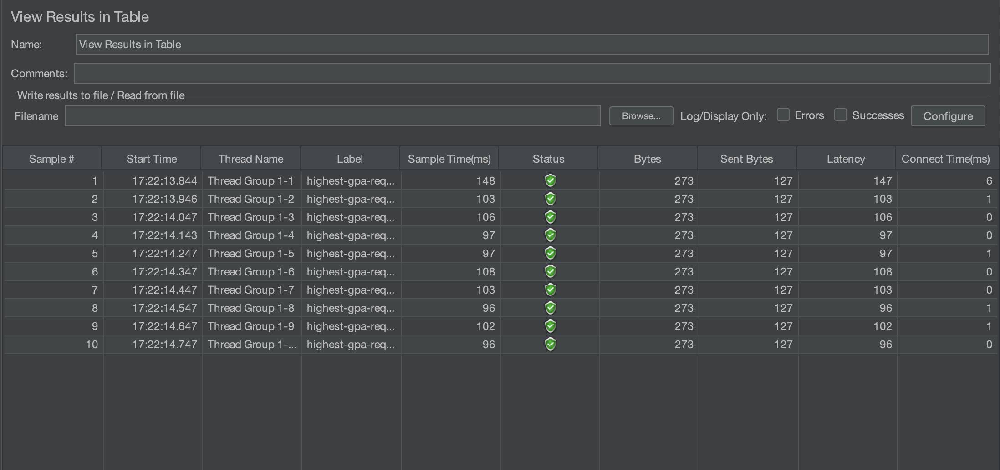
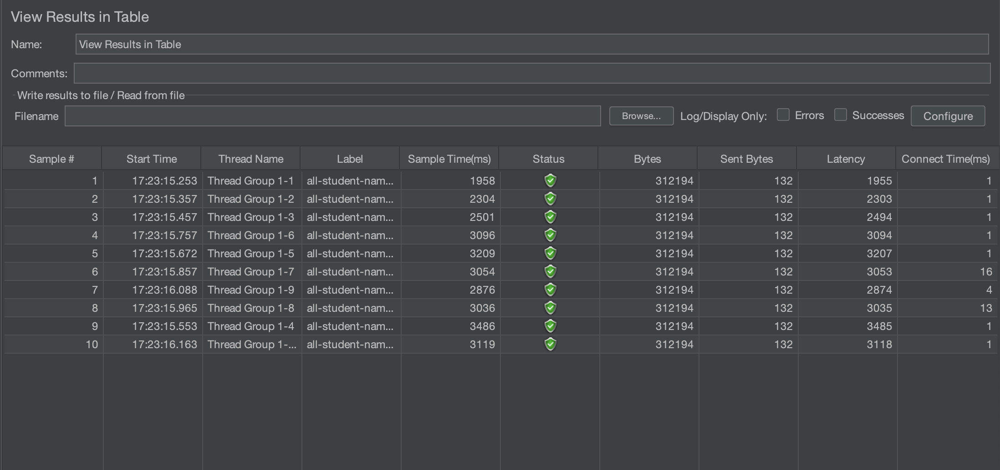
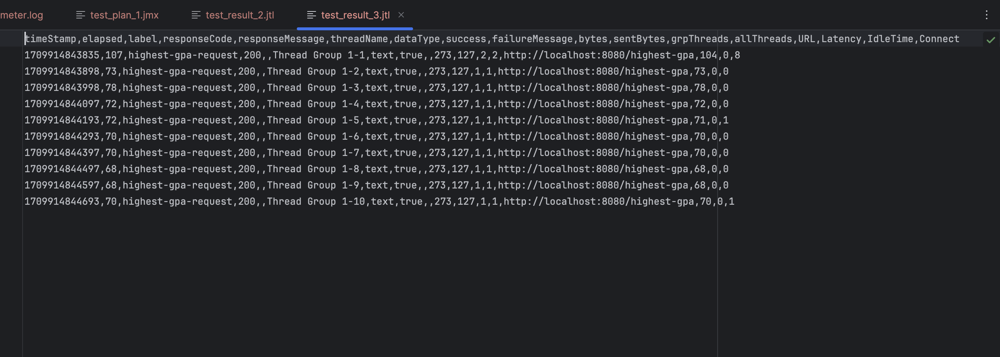
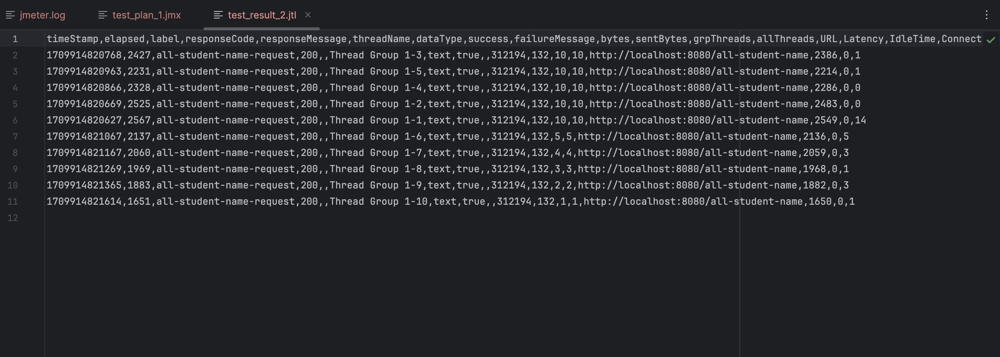
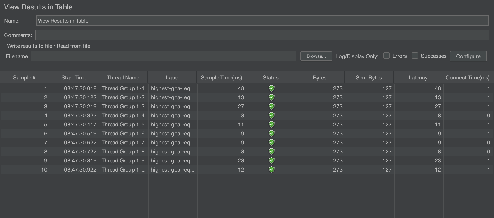
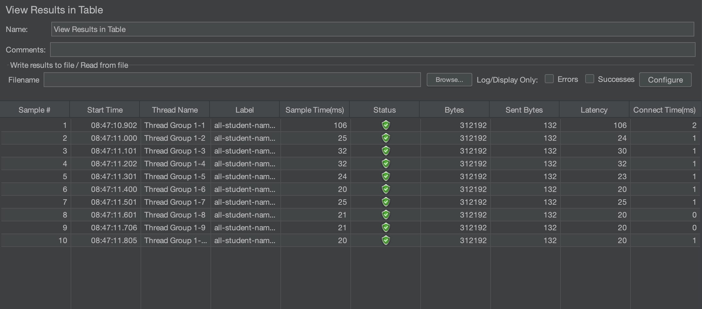

## Screenshots 

highest-gpa test using JMeter GUI

all-sudent-name test using JMeter GUI

highest-gpa test using JMeter CLI

all-sudent-name test using JMeter CLI

highest-gpa test using JMeter GUI after optimization

all-sudent-name test using JMeter GUI after optimization

It can be seen that the sample time and latency are improved much after optimization. It means that the bottlenecks found in the profiling result are fixed and the overall performance is improved.

## Reflection 

1. The performance testing with JMeter and IntelliJ Profiler have different main goal. JMeter focuses on the broader aspect of testing, that is simulating the users using our application so we know whether our application has run within a reasonable amount of time, with reasonable memory usage, etc. IntelliJ Profiler is more specific and code-level. It helps us identify the bottlenecks in our code, which might be a slow block of codes or inefficient memory usage.

2. Profiling shows us the performances of many parts of our application. That way, we can notice the weak points, for example the methods that use most CPU time. 

3. I think IntelliJ Profiler is effective. It's easy to use and displays a clear result in various forms flame graph view, tree view, etc. It also provides a shortcut-click to go to the part of code that are reported in the result views. 
   
4. I think it's conducting a poor test unconciously, and getting a false result (like a false positive). We can apply the tips and tricks written in this module to make a test as accurate as possible.   
   
5. We can conduct the profiling easily with a GUI. We don't need to modify our code or deep dive to our OS monitoring tools. IntelliJ Profiler also enables us to go to the problematic method easily, fix it, and compare the result with the previous profiling session. 
   
6. Recheck both test, perhaps there's a thing we configured wrong that affect the result. If none, I think it's ok to fix the result pointed out in profiling since it is more specific. 
   
7. After performing test and profiling, we should optimize the part of codes that matters the most (the bottleneck). Just try to think what makes it inefficient, perhaps try a faster algorithm, or take a closer look at the complexity of external methods we use (such as those we imported) and find a better approach. To ensure the correctess, we run a unit test or functional test like what we did in the previous module. 
